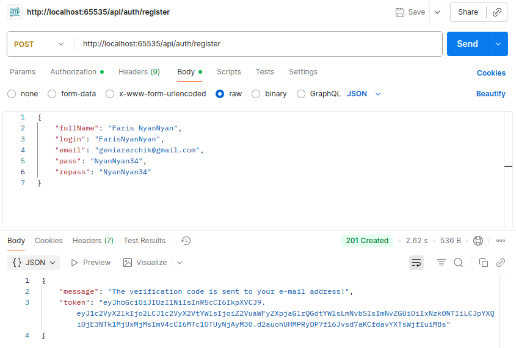

# Innovation Campus USOF
## About the app
This is the project created during the education in NTU "KhPI" according to the Innovation Campus program. USOF is a forum where you can publish posts and comment them (my forum is called **Stomach Overflow** and users of my app can discuss everything about cooking).

## How to download
**You will need:**
* Node.js
* npm
* MySQL
* Postman (to handle routes without the frontend)
**Uploading**
1. Download all dependencies:
```bash
npm install
```
2. Download the database:
```bash
mysql -u root -p < db.sql
```
3. After downloading the database, correct some data:
  * Run MySQL:
```bash
mysql -u root -p
```
  * Write other e-mail addresses to users (pre-built addresses are not existent; there is mailing of letters in the app, so users must have real e-mail address):
```sql
use stomach_overflow;
-- Watch information about all the users:
SELECT * FROM users;
-- Changing e-mail addresses:
UPDATE users SET email_address = [your e-mail address] WHERE id = [any user's id];
exit;
```
## How to run
1. Run the command in the root directory:
```bash
node index.js
```
2. Copy the link from the terminal.
3. Paste the link in Postman (because there is no frontend yet).
## Documentation for the project:
For the information about the usage of the app read the [Official Stomach Overflow Documentation](https://docs.google.com/document/d/1VTtelaNjCpbmt7tRmX8bE_2_yzD21DtBtSzT29xfu8s/edit?usp=sharing).
**P.S.** All existent or similar to existent names and characters are used *only for educational purposes*!
