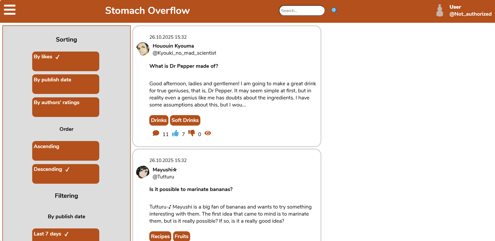
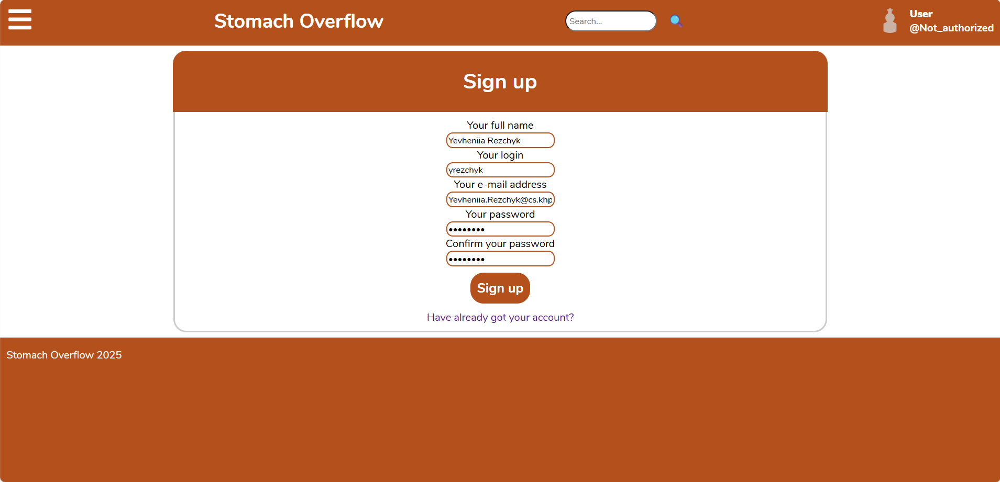
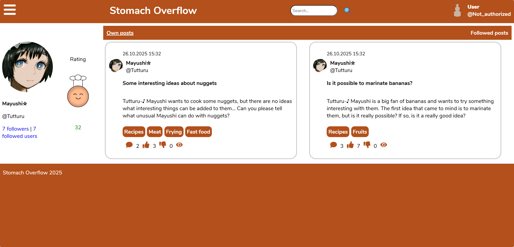
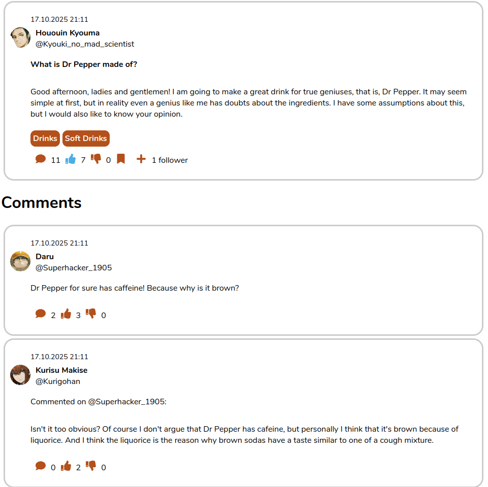

# Innovation Campus USOF
## About the app
This is the project created during the education in NTU "KhPI" according to the Innovation Campus program. USOF is a forum where you can publish posts and comment them (my forum is called **Stomach Overflow** and users of my app can discuss everything about cooking).
## Screenshots of the app in use
### The main page

### Signing up

### Profile page

### Post page

## How to download
### You will need:
* Node.js
* npm
* MySQL
### Uploading
1. Download all dependencies in the "api" folder:
```bash
npm install
```
2. Drop the "stomach_overflow" database:
```bash
mysql -u root -p
DROP DATABASE IF EXISTS stomach_overflow;
exit;
```
3. Download the database:
```bash
mysql -u root -p < db.sql
```
4. Download all dependencies in the root folder:
```bash
npm install
```
## How to run
1. Run the server by writing the command in the "api" directory:
```bash
node index.js
```
2. Run the client by writing the command in the root directory:
```bash
npm start
```
**Note**: you can reset a password of some existent user and then change it before signing in as this user or sign in immediately by the password "l23456789O".
## Documentation for the project:
For the information about the usage of the app read the [Official Stomach Overflow Documentation](https://docs.google.com/document/d/1UMNPxxLNSKEt2JvsmC3zOKOSbzrCyrheFb14Mhi2_c8/edit?usp=sharing).
## P.S.
All existent or similar to existent names and characters are used *only for educational purposes*!
